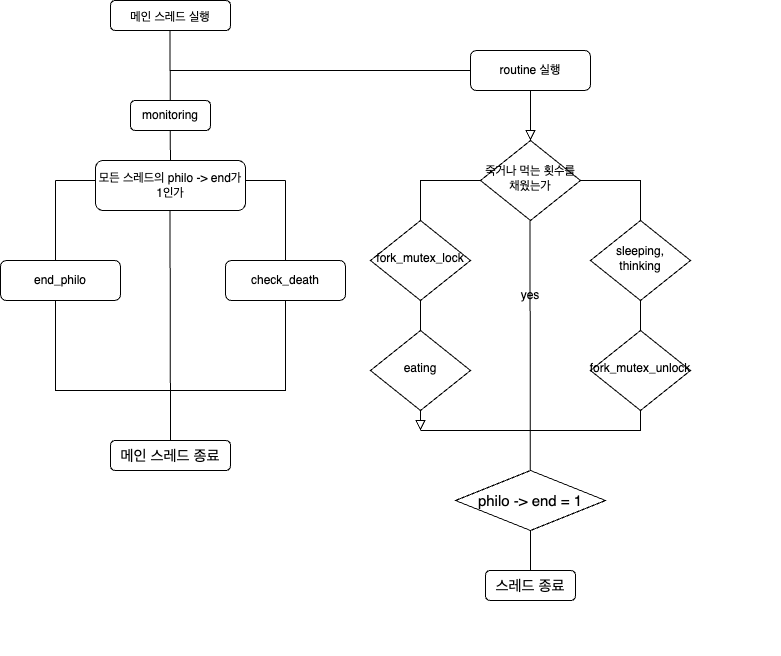

# mandatory

1. 철학자 스레드는 sleeping, thinking, eating을 반복하며 언제 어떤 행동을 취하는지를 출력합니다.  
2. 철학자가 먹는 횟수를 채우면(philo->state == must) 반복문을 탈출합니다.
3. 철학자 본인이 굶어 죽거나 다른 철학자가 죽으면(philo->sh_info->death == 1) 반복문을 탈출합니다.
4. 반복문을 탈출하면, philo->end를 1로 바꾸고 스레드를 종료합니다.
5. 모니터링 스레드(메인 스레드)는, 철학자의 마지막 식사시간을 모니터링하면서 제한시간을 넘기는 경우 philo->sh_info->death를 1로 바꿉니다.  
6. 동시에, 반복문을 돌면서 모든 스레드의 philo->end가 1인지를 계속 검사합니다. 
7. 모든 스레드의 philo->end가 1인 경우 프로세스를 종료합니다.  

# bonus

1. 부모 프로세스
2. 자식 프로세스 - 모니터링 스레드
3. 자식 프로세스 - 철학자 스레드
philo->end