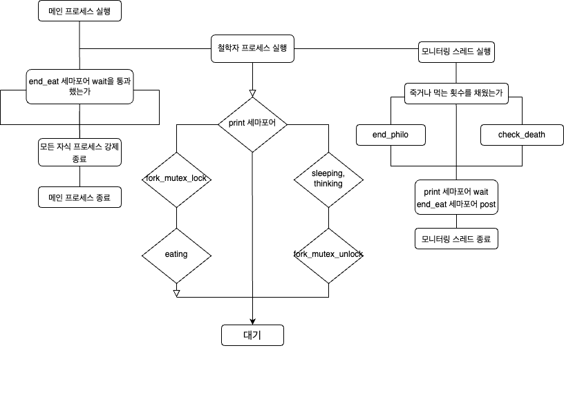

# mandatory
  
하나의 스레드가 모든 철학자의 상태를 관리합니다.  
1. 자식 스레드 - 철학자 스레드  

	a. start_simulation 함수는 모든 스레드가 동시에 시뮬레이션을 시작할 수 있도록 합니다.  
		(특정 공유변수가 철학자 숫자와 같아질 때 까지 ++연산을 하면서 반복문을 돌립니다)  

	b. 철학자 스레드는 sleeping, thinking, eating을 반복하며 언제 어떤 행동을 취하는지를 출력합니다.  

	c. 철학자가 먹는 횟수를 채우면(philo->state == must) 반복문을 탈출합니다.  

	d. 철학자 본인이 굶어 죽거나 다른 철학자가 죽으면(philo->sh_info->death == 1) 반복문을 탈출합니다.  

	e. 반복문을 탈출하면, philo->end를 1로 바꾸고 스레드를 종료합니다.  

2. 메인 스레드 - 모니터링 스레드  

	a. 모니터링 스레드(메인 스레드)는, 철학자의 마지막 식사시간을 모니터링하면서 제한시간을 넘기는 경우 philo->sh_info->death를 1로 바꿉니다.  

	b. 동시에, 반복문을 돌면서 모든 스레드의 philo->end가 1인지를 계속 검사합니다.  

	c. 모든 스레드의 philo->end가 1인 경우 프로세스를 종료합니다.  

# bonus
  
각 철학자 프로세스 별로 스레드를 두어 상태를 관리합니다.  
1. 자식 프로세스 - 철학자 스레드  
	a. start_simulation 함수는 모든 프로세스가 동시에 시뮬레이션을 시작할 수 있도록 합니다.  
		(특정 공유변수가 철학자 숫자와 같아질 때 까지 ++연산을 하면서 반복문을 돌립니다)  

	b. 철학자 스레드는 sleeping, thinking, eating을 반복하며 언제 어떤 행동을 취하는지를 출력합니다.  

	c. 철학자가 먹는 횟수를 채우면(philo->sh_info->must_eat == must) 반복문을 탈출합니다.   

	d.  반복문을 탈출하면, philo->end를 1로 바꾸고 스레드를 종료합니다.  
2. 자식 프로세스 - 모니터링 스레드  

	a. 모니터링 스레드(메인 스레드)는, 철학자의 마지막 식사시간을 모니터링하면서 제한시간을 넘기는 경우 print 세마포어를 wait 시킵니다.  
		이를 통해 다른 철학자들이 다른 행동을 출력하는 것을 막습니다.  

	b. 모든 철학자들의 end_eat 세마포어를 post 해줍니다.

	c. exit로 모니터링 스레드와 철학자 스레드를 모두 종료합니다.  

	d. 만약 먹는 횟수 제한에 도달한 경우, 해당 철학자의 end_eat 세마포어만 post 한 후 exit 합니다.
3. 부모 프로세스  
	a. 부모 프로세스는 모든 자식 프로세스(철학자들)를 fork 한 후, 철학자들의 pid를 저장합니다.  
	
	b. 모든 철학자들의 end_eat 세마포어에 대해 wait을 시키고 대기합니다.
	  
	b. 이 wait 반복문을 탈출 한 경우, 모든 철학자의 식사가 끝났거나 누군가가 죽은 상황이므로 모든 철학자 프로세스에 kill을 날린 후 종료합니다.